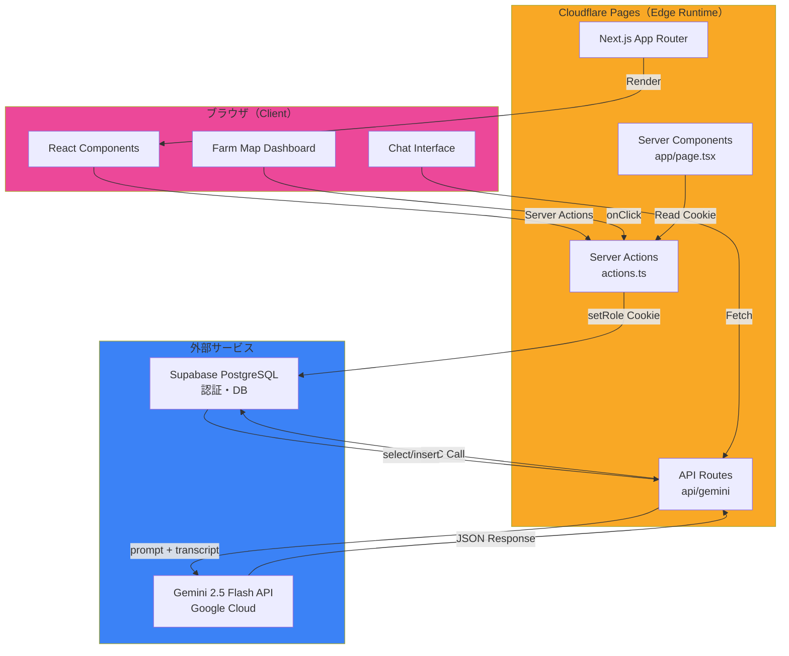
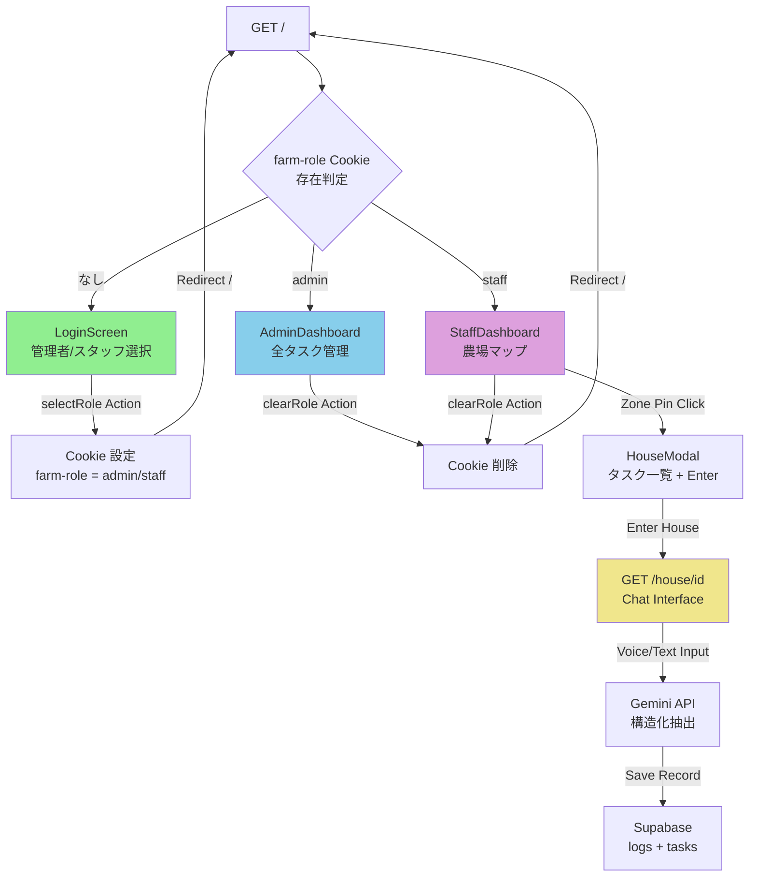
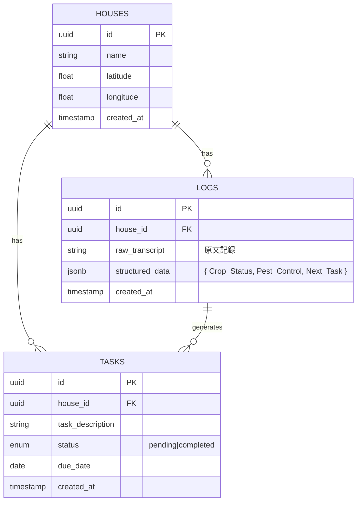

# 農業DX タスク管理システム — 詳細設計書およびアーキテクチャ定義書

## 1. プロジェクト概要

### 1.1 システムの目的と目標

**農業DX タスク管理システム** は、小規模から中規模の農業経営体における日々のタスク管理、作業記録、および言語障壁の解決を目指すクラウドベースのプラットフォームです。

#### 主な解決課題

| 課題 | 解決方法 |
|------|---------|
| 複雑な作業指示の伝達 | Admin Dashboard で全体タスクを一元管理し、スタッフへ効率的に配信 |
| 言語の多様性（ハウスで働く外国人労働者の言語対応） | Gemini 2.5 Flash による自動言語検出・翻訳機能（日本語 ↔ タイ語） |
| 作業実績の追跡・監視 | 音声/テキスト入力による作業記録、自動構造化データ抽出 |
| 農場レイアウトの可視化 | インタラクティブな Farm Map Dashboard（ゾーン配置図＋クリック操作） |
| スタッフの負担軽減 | Staff Dashboard：シンプルな地図ベースUI、NFC スキャン → 音声入力フロー |

### 1.2 主な機能

#### 1. ロールベース レンダリング（/）
- **ログイン画面** → 管理者 or スタッフロールを選択
- **管理者ダッシュボード** → 全ハウスのタスク一覧、フィルタリング、統計
- **スタッフダッシュボード** → 農場マップ、担当ハウスへのドリルダウン

#### 2. インタラクティブな農場マップ（/）
- 4 つのハウス/畑をピン表示
- ピンクリック → ボトムシートモーダル表示
- タスク数バッジ付きピン
- タスクリスト表示

#### 3. ハウス固有ページ（/house/[id]）
- Chat Interface による音声 + テキスト入力
- Gemini API による自動構造化データ抽出
- 作業記録（ログ）の保存
- 次回タスクの自動生成

#### 4. マルチリンガルサポート
- **対応言語**: 日本語（ja）、タイ語（th）
- **自動言語検出** → Gemini AI が入力言語を判定
- **日本語への自動翻訳** → DB 保存時は全フィールドを日本語に統一
- **返答の言語切り替え** → ユーザーの入力言語で AI が返答

---

## 2. システムアーキテクチャ

### 2.1 技術スタック

| レイヤー | 技術 | バージョン | 用途 |
|---------|------|-----------|------|
| **フロントエンド** | React | 19.0.0 | UI コンポーネント |
| **フレームワーク** | Next.js | 15.1.0 | SSR、API Routes、Server Components |
| **ランタイム** | Cloudflare Pages | — | Edge Runtime デプロイメント |
| **スタイリング** | Tailwind CSS | 3.4.17 | ユーティリティベース CSS |
| **アイコン** | Lucide React | 0.513.0 | SVG アイコン |
| **バックエンド DB** | Supabase（PostgreSQL） | 2.49.0 | リレーショナルDB、認証 |
| **AI モデル** | Gemini 2.5 Flash | — | テキスト抽出、言語検出、翻訳 |
| **言語** | TypeScript | 5.7.0 | 型安全性 |

### 2.2 インフラストラクチャ アーキテクチャ



### 2.3 デプロイメント フロー

```
GitHub Repository (kojima-farm-task-manager)
    ↓
    git push origin main
    ↓
Cloudflare Pages (自動トリガー)
    ↓
    @cloudflare/next-on-pages
    Build Output: .vercel/output/static
    ↓
wrangler.toml 読み込み
    - pages_build_output_dir = ".vercel/output/static"
    - nodejs_compat フラグ有効化
    ↓
Cloudflare Edge Runtime
    - すべての動的ルート: export const runtime = 'edge'
    ↓
本番環境（https://agricultural-dx-task-management.pages.dev）
```

### 2.4 Edge Runtime における制約と最適化

| 項目 | 説明 |
|------|------|
| **動的ルート必須** | すべての Server Component ページと API Routes に `export const runtime = 'edge'` を付与 |
| **Supabase 互換性** | `@supabase/ssr` の `createServerClient` を使用 → Edge Runtime で動作 |
| **Cookie 管理** | `next/headers` の `cookies()` を使用 → httpOnly フラグで XSS 対策 |
| **ビルド設定** | `wrangler.toml` に `pages_build_output_dir` 指定 → Cloudflare が正しく認識 |
| **型安全性** | `"strict": true` in tsconfig → CookieOptions などは明示的型指定が必須 |

---

## 3. 画面・UI遷移フロー

### 3.1 全体ナビゲーション フロー



### 3.2 AdminDashboard（管理者向け）

**目的**: 全ハウスのタスク一覧を一元管理し、進捗追跡と指示を効率化

#### 画面レイアウト

```
┌─────────────────────────────────┐
│  📋 タスク指令センター  [ログアウト] │
│  管理者: Naoki                   │
└─────────────────────────────────┘
┌─────────────────────────────────┐
│  12件    7件未完了    5件完了    │
│ 合計タスク  未完了     完了       │
└─────────────────────────────────┘
┌─────────────────────────────────┐
│  [すべてのステータス ▼] [全エリア ▼]  │
│  Filter Icon                    │
└─────────────────────────────────┘
┌─────────────────────────────────┐
│  12 / 12 件表示     各エリアのハウスへ │
├─────────────────────────────────┤
│  ⏳ トマトの誘引・整枝作業         │
│    [ハウスA] 09:00 2026-05-06    │
│    未完了                        │
├─────────────────────────────────┤
│  ✓ 施肥（窒素系）                  │
│    [ハウスB] 11:00 2026-05-05    │
│    完了                          │
│         ... (スクロール)           │
└─────────────────────────────────┘
```

#### 主要機能

| 機能 | 説明 |
|------|------|
| **ステータスフィルタ** | すべて / 未完了のみ / 完了のみ |
| **エリアフィルタ** | 全エリア / ハウスA / ハウスB / ハウスC / 露地畑A |
| **統計表示** | 合計タスク数、未完了件数、完了件数 |
| **タスク行の表示** | ステータスアイコン、説明、ゾーン、時間、日付、ステータスバッジ |
| **ログアウト** | ロール Cookie をクリアして LoginScreen に戻る |

### 3.3 StaffDashboard（スタッフ向け）

**目的**: 農場レイアウトを視覚的に把握し、担当ハウスへのドリルダウン

#### 画面レイアウト

```
┌──────────────────────────────────────────┐
│  🌾 農場マップダッシュボード  [ログアウト] │
│  明日の作業: 5月6日（月）                 │
└──────────────────────────────────────────┘
┌──────────────────────────────────────────┐
│                                          │
│      ハウスB          ハウスA             │
│      [5] ░░░░░░░░    [3]                │
│    ░░░░░░░░░░░░░░░   ░░░░░░             │
│   ░░░░░░░░░░░░░░░░░░░░░░░░░             │
│          露地畑A                          │
│          [2]                             │
│                       ハウスC             │
│                       [1]                │
│                      ░░░░░░              │
└──────────────────────────────────────────┘
┌──────────────────────────────────────────┐
│  📋 明日の作業タスク                       │
├──────────────────────────────────────────┤
│  🌳 ハウスA（トマト）  09:00  [▶]        │
│  🌾 露地畑A          14:00  [▶]        │
│  🍒 ハウスC（イチゴ）  09:30  [▶]        │
│  🥒 ハウスB（きゅうり）10:30  [▶]        │
└──────────────────────────────────────────┘
```

#### インタラクション

| 操作 | 動作 |
|------|------|
| **ピンをクリック** | HouseModal を表示（タスク一覧 + Enter ボタン） |
| **Enter House ボタン** | `/house/[id]` へ遷移、Chat Interface を表示 |
| **タスク行をクリック** | 対応する Zone Modal を表示 |
| **ログアウト** | ロール Cookie をクリア、LoginScreen へ戻る |

### 3.4 ハウス固有ページ（/house/[id]）

**目的**: スタッフが音声/テキストで作業記録を報告し、Gemini が構造化データに変換して保存

#### 画面フロー

```
┌───────────────────────────────────┐
│  ハウスA（トマト）        [← 戻る] │
└───────────────────────────────────┘
┌───────────────────────────────────┐
│       Chat Message History         │
│                                   │
│  [AI] 作業状況をお知らせください    │
│       (トマトの健康状態、病害虫など) │
│                                   │
│  [スタッフ]                        │
│  トマトは元気です。昨日、左側の     │
│  列でアブラムシが見つかったので、   │
│  薬をかけました。                 │
│                                   │
│  [AI] 作業状況を記録しました。    │
│       明日の作業予定は?           │
│                                   │
│  [スタッフ]                        │
│  明日は引綱と整枝をやります。      │
│                                   │
│  [AI] ✓ 作業記録を保存しました！   │
└───────────────────────────────────┘
┌───────────────────────────────────┐
│  [📝 入力欄] [🎤] [送信]             │
│  pb-safe (iOS対応)                │
└───────────────────────────────────┘
```

#### データ抽出ロジック（2フェーズ）

| フェーズ | 入力 | 出力 | 遷移 |
|---------|------|------|------|
| **Phase 1: 初期抽出** | 作業報告（音声/テキスト） | Crop_Status, Pest_Control, Next_Task | Next_Task なし → Phase 2 へ |
| **Phase 2: 次回タスク収集** | 次回作業内容（追加入力） | Next_Task のみ抽出 | 両フェーズ完了 → 保存 |

---

## 4. AI・音声通訳フロー

### 4.1 Gemini 2.5 Flash による多言語処理

#### ワークフロー

```mermaid
flowchart LR
    A["ユーザー入力<br/>テキスト or 音声<br/>言語: ja/th"] -->|Web Speech API| B["Transcript"]
    B -->|POST /api/gemini| C["Phase 1: Extract"]
    C -->|buildExtractionPrompt| D["Gemini AI"]
    D -->|1. 言語検出ja/th<br/>2. 日本語に翻訳<br/>3. 構造化抽出| E["JSON Response"]
    E -->|Crop_Status<br/>Pest_Control<br/>Next_Task<br/>detected_language| F{Next_Task<br/>存在?}
    F -->|なし| G["Phase 2<br/>buildNextTaskRequestReply"]
    F -->|あり| H["Save Record RPC"]
    G -->|日本語/タイ語で質問| I["ユーザー追加入力"]
    I -->|buildNextTaskPrompt| J["Gemini AI"]
    J -->|Next_Task抽出<br/>言語検出| K["JSON Response"]
    K -->|Next_Task| H
    H -->|save_farm_record RPC| L["Supabase<br/>logs + tasks"]
    H -->|buildConfirmationReply| M["返答メッセージ<br/>detected_language で言語選択"]
    M -->|日本語/タイ語| N["Chat に表示"]

    style D fill:#3b82f6
    style N fill:#90ee90
```



### 4.2 言語サポート（ja / th）

#### 言語検出 → 返答言語選択メカニズム

```typescript
// Phase 1 レスポンス例
{
  "Crop_Status": "トマトは元気です",           // ← 日本語に翻訳済み
  "Pest_Control": "アブラムシを防除した",      // ← 日本語に翻訳済み
  "Next_Task": null,
  "detected_language": "th"                    // ← タイ語入力を検出
}

// 返答言語
const replies = {
  ja: "作業状況を記録しました。明日はどのような...",
  th: "บันทึกสถานะการทำงานเรียบร้อยแล้ว..."
}
→ replies[detected_language] で返答
```

#### 対応言語一覧

| 言語コード | 言語名 | 対応範囲 |
|-----------|--------|---------|
| `ja` | 日本語 | ✓ 入力認識、DB保存、AI返答 |
| `th` | タイ語 | ✓ 入力認識、DB保存、AI返答 |

### 4.3 プロンプト設計

#### Phase 1: 初期抽出プロンプト

```
You are a multilingual AI assistant that analyzes farm work reports in Japanese or Thai.

CRITICAL INSTRUCTIONS:
1. Detect language: "ja" or "th"
2. Extract three fields from the transcript
3. TRANSLATE each field to Japanese (mandatory for DB storage)
4. Include "detected_language" in response

Extract:
- Crop_Status: 作物の状態
- Pest_Control: 病害虫管理
- Next_Task: 次回作業予定
- detected_language: "ja" or "th"

Return ONLY valid JSON (no markdown).
```

#### Phase 2: 次回タスク抽出プロンプト

```
You are a multilingual AI assistant. The user has provided follow-up about next task.

CRITICAL INSTRUCTIONS:
1. Detect language: "ja" or "th"
2. Extract "next task" content
3. TRANSLATE TO JAPANESE (mandatory for DB)
4. Return JSON with both fields

Return ONLY: {"Next_Task": "...", "detected_language": "ja or th"}
```

### 4.4 エラーハンドリングと フォールバック

| シナリオ | 対応 |
|---------|------|
| JSON パース失敗 | ユーザーに再入力を促すメッセージを返す |
| Next_Task が不明確 | Phase 2 へ遷移、詳細な質問を再度表示 |
| Gemini API エラー | "サーバーエラーが発生しました" と返す |
| 言語検出失敗 | デフォルト: `ja` を使用 |

---

## 5. データベース設計

### 5.1 ER ダイアグラム



### 5.2 テーブル定義

#### `public.houses`

| カラム | 型 | 制約 | 説明 |
|--------|-----|------|------|
| `id` | `uuid` | PK | Supabase 自動生成 |
| `name` | `text` | NOT NULL | ハウス名（例: "ハウスA（トマト）"） |
| `latitude` | `numeric` | NULLABLE | 位置情報（将来拡張用） |
| `longitude` | `numeric` | NULLABLE | 位置情報（将来拡張用） |
| `created_at` | `timestamp` | DEFAULT NOW() | 作成日時 |

#### `public.tasks`

| カラム | 型 | 制約 | 説明 |
|--------|-----|------|------|
| `id` | `uuid` | PK | Supabase 自動生成 |
| `house_id` | `uuid` | FK → houses.id | 割当先ハウス |
| `task_description` | `text` | NOT NULL | タスク内容（日本語） |
| `status` | `text` | DEFAULT 'pending' | 進捗状態 |
| `due_date` | `date` | NULLABLE | 期日（JST） |
| `created_at` | `timestamp` | DEFAULT NOW() | 作成日時 |

**インデックス:**
- `tasks_house_id_idx` on `house_id`
- `tasks_due_date_idx` on `due_date`
- `tasks_status_idx` on `status`

#### `public.logs`

| カラム | 型 | 制約 | 説明 |
|--------|-----|------|------|
| `id` | `uuid` | PK | Supabase 自動生成 |
| `house_id` | `uuid` | FK → houses.id | 報告者のハウス |
| `raw_transcript` | `text` | NULLABLE | 原文記録（両言語の場合は結合） |
| `structured_data` | `jsonb` | NULLABLE | `{ Crop_Status, Pest_Control, Next_Task }` |
| `created_at` | `timestamp` | DEFAULT NOW() | 記録日時 |

**インデックス:**
- `logs_house_id_idx` on `house_id`
- `logs_created_at_idx` on `created_at`

### 5.3 PostgreSQL RPC 関数: `save_farm_record`

```sql
CREATE OR REPLACE FUNCTION save_farm_record(
  p_house_id UUID,
  p_raw_transcript TEXT,
  p_structured_data JSONB,
  p_task_description TEXT,
  p_due_date DATE
)
RETURNS void AS $$
BEGIN
  -- 1. ログエントリを挿入
  INSERT INTO logs (house_id, raw_transcript, structured_data)
  VALUES (p_house_id, p_raw_transcript, p_structured_data);

  -- 2. タスクを挿入（Next_Task が null でない場合のみ）
  IF p_task_description IS NOT NULL THEN
    INSERT INTO tasks (house_id, task_description, status, due_date)
    VALUES (p_house_id, p_task_description, 'pending', p_due_date);
  END IF;
EXCEPTION WHEN others THEN
  RAISE;
END;
$$ LANGUAGE plpgsql;
```

**利点:**
- トランザクション一貫性 → ログと タスクが必ず同時に保存される
- 原子性 → エラー時は両方ロールバック
- ネットワーク往復削減 → RPC 1 回で両 INSERT 実行

### 5.4 データフロー（Chat → DB）

```
┌─────────────────────────────────────────┐
│  Chat Interface                         │
│  スタッフ入力（日本語 or タイ語）           │
└─────────────────────────────────────────┘
         ↓ Web Speech API / 手入力
┌─────────────────────────────────────────┐
│  ChatInterface.tsx                      │
│  sendTranscript(transcript)             │
└─────────────────────────────────────────┘
         ↓ fetch POST
┌─────────────────────────────────────────┐
│  API Route: api/gemini/route.ts         │
│  phase: 'initial' | 'awaiting_next_task'│
└─────────────────────────────────────────┘
         ↓ prompt + Gemini API
┌─────────────────────────────────────────┐
│  Gemini 2.5 Flash                       │
│  言語検出 + 日本語翻訳 + 抽出            │
└─────────────────────────────────────────┘
         ↓ JSON Response
┌─────────────────────────────────────────┐
│  StructuredFarmData                     │
│  {                                      │
│    Crop_Status: string | null,          │
│    Pest_Control: string | null,         │
│    Next_Task: string | null             │
│  }                                      │
└─────────────────────────────────────────┘
         ↓ supabase.rpc()
┌─────────────────────────────────────────┐
│  PostgreSQL: save_farm_record()          │
│  → logs テーブル + tasks テーブル        │
└─────────────────────────────────────────┘
```

---

## 6. ディレクトリ構成と主要ファイル

### 6.1 プロジェクト構造

```
農業DXタスク管理システム/
├── app/                                 # Next.js App Router
│   ├── page.tsx                         # ロール判定 → 画面レンダリング
│   ├── actions.ts                       # Server Actions（selectRole, clearRole）
│   ├── api/
│   │   └── gemini/
│   │       └── route.ts                 # Gemini API エンドポイント
│   ├── house/
│   │   └── [id]/
│   │       └── page.tsx                 # ハウス固有ページ（Chat Interface）
│   └── layout.tsx                       # グローバルレイアウト
│
├── components/                          # React コンポーネント
│   ├── LoginScreen.tsx                  # ロール選択画面
│   ├── AdminDashboard.tsx               # 管理者ダッシュボード
│   ├── StaffDashboard.tsx               # スタッフダッシュボード + ラッパー
│   ├── FarmMapDashboard.tsx             # インタラクティブ農場マップ
│   ├── ChatInterface.tsx                # チャット UI（音声/テキスト入力）
│   ├── ChatMessageBubble.tsx            # メッセージバブル表示
│   ├── VoiceButton.tsx                  # マイクボタン
│   └── TaskPopupModal.tsx               # モーダル（未使用/将来拡張）
│
├── lib/                                 # ユーティリティ・型定義
│   ├── types.ts                         # TypeScript インターフェース
│   └── supabase/
│       ├── server.ts                    # Server-side Supabase クライアント
│       └── client.ts                    # Client-side Supabase クライアント
│
├── public/                              # 静的ファイル
│   └── (favicon 等)
│
├── docs/                                # ドキュメント
│   └── SYSTEM_DESIGN.md                 # このファイル
│
├── supabase/                            # Supabase マイグレーション
│   └── migrations/
│       └── 001_save_farm_record_rpc.sql # RPC 関数定義
│
├── .env.local.example                   # 環境変数テンプレート
├── package.json                         # 依存パッケージ
├── tsconfig.json                        # TypeScript 設定
├── tailwind.config.ts                   # Tailwind CSS 設定
├── next.config.ts                       # Next.js 設定
├── wrangler.toml                        # Cloudflare Pages 設定
└── README.md                            # プロジェクト概要
```

### 6.2 主要ファイルの責務

#### `app/page.tsx`
- **役割**: ルートページのロール判定
- **処理**: `cookies()` を読み込み、`farm-role` の値に応じてコンポーネントを選択
- **出力**: LoginScreen / AdminDashboard / StaffDashboard
- **重要**: `export const runtime = 'edge'` で Edge Runtime を指定

#### `app/actions.ts`
- **役割**: Server Actions（セキュアなサーバー操作）
- **関数**:
  - `selectRole(formData)`: ロール選択時に httpOnly Cookie を設定
  - `clearRole()`: ログアウト時に Cookie を削除
- **重要**: `'use server'` 宣言、フォームからのみ呼び出し可能

#### `app/api/gemini/route.ts`
- **役割**: Gemini API への中継、AI 処理
- **処理**:
  1. Phase 1: 初期抽出（Crop_Status, Pest_Control, Next_Task）
  2. Phase 2: Next_Task の詳細化
  3. save_farm_record RPC でDB保存
- **言語**: 自動検出 (ja/th) → 日本語に翻訳して保存

#### `components/FarmMapDashboard.tsx`
- **役割**: インタラクティブな農場マップUI
- **機能**: ピン表示、モーダル表示、タスク一覧、色分け
- **インタラクション**: ピンクリック → HouseModal、Enter → /house/[id]

#### `components/ChatInterface.tsx`
- **役割**: 音声/テキスト入力UI、メッセージ表示
- **機能**:
  - Web Speech API によるマイク入力
  - テキストボックス入力
  - チャットメッセージ履歴表示
  - Gemini API への fetch

#### `lib/supabase/server.ts`
- **役割**: Edge Runtime 互換の Supabase クライアント
- **特徴**: `@supabase/ssr` を使用、Server Components / Route Handlers / Server Actions で利用可能

#### `lib/types.ts`
- **役割**: 全体で使用する TypeScript インターフェース
- **含有**: House, Task, Log, StructuredFarmData, GeminiApiRequest/Response 等

---

## 7. 今後の拡張性と課題

### 7.1 セキュリティ考慮事項

#### 現在の実装

| 項目 | 現状 | リスク |
|------|------|--------|
| **認証** | Cookie ベース（role のみ） | 本人確認がない → スタッフなりすまし可能 |
| **XSS 対策** | httpOnly Cookie | ✓ 有効 |
| **CSRF 対策** | Server Actions（自動） | ✓ Next.js が処理 |
| **API 認証** | `GEMINI_API_KEY` (環境変数) | ✓ 安全（サーバー側のみ） |

#### 推奨される将来の強化

1. **Supabase Auth 統合**
   - メールアドレス/パスワード or OAuth（Google/GitHub）
   - スタッフごとの ID・パーミッション管理
   - セッション トークン（JWT）

2. **RBAC（ロールベース アクセス制御）**
   - データベースレベルの RLS（Row Level Security）
   - API レベルの権限チェック
   - 管理者のみがタスク削除可能、等

3. **監査ログ**
   - 誰が、いつ、何を操作したかを記録
   - Supabase の `audit.logs` テーブル活用

### 7.2 パフォーマンス最適化

#### 現在の制限

| 項目 | 説明 |
|------|------|
| **リアルタイム更新** | ポーリング or WebSocket なし（Chat は手動リロード） |
| **オフライン対応** | なし（ネットワーク必須） |
| **キャッシング** | なし（毎回 API 呼び出し） |
| **画像最適化** | 必要に応じて実装 |

#### 推奨される最適化

1. **Supabase Realtime**
   ```typescript
   // タスク更新をリアルタイムで監視
   supabase
     .channel('public:tasks')
     .on('postgres_changes', { event: '*', schema: 'public', table: 'tasks' }, cb)
     .subscribe()
   ```

2. **Next.js 13+ キャッシング**
   ```typescript
   // ページキャッシュ（ISR）
   export const revalidate = 60; // 60秒ごとに再生成
   ```

3. **Service Worker / Offline**
   - `next-pwa` で PWA 化
   - IndexedDB でオフラインデータ保持

4. **Lazy Loading**
   - 画像、モーダル内容を遅延読み込み

### 7.3 スケーラビリティ

#### 水平スケーリング計画

| レイヤー | 対応状況 | 制限 |
|---------|---------|------|
| **フロントエンド** | ✓ Cloudflare Pages（無制限自動スケール） | なし |
| **API（Gemini）** | ～ 要リクエスト管理 | API クォータ、レート制限 |
| **データベース** | ◐ Supabase PostgreSQL | 接続数、ストレージ |
| **チャットログ** | ◐ JSONB で保持（圧縮検討） | ストレージ肥大化 |

#### 対応策

1. **API クォータ管理**
   - Gemini API の `batchProcessRequests` を活用
   - レート制限の実装（例: Redis）

2. **DB 性能維持**
   - 定期的にログをアーカイブ（古いログを削除 or 別テーブルへ）
   - インデックス最適化

3. **キャッシング戦略**
   - 頻繁にアクセスするハウス情報を Redis キャッシュ

### 7.4 既知の制限と課題

#### UI/UX

| 課題 | 影響 | 対応案 |
|------|------|--------|
| **NFC リーダー未実装** | スタッフが手動でハウス選択 | Web NFC API 統合（Android 対応） |
| **音声認識の精度** | タイ語での誤認識可能性 | 継続的なプロンプト最適化、ユーザーフィードバック |
| **モーダル閉じるX ボタンのUX** | 小さいと誤操作 | タップターゲット最小 48px に拡大 |

#### 技術的

| 課題 | 影響 | 対応案 |
|------|------|--------|
| **TypeScript strict mode** | 開発効率低下 | 段階的に strict を導入、型定義ライブラリ活用 |
| **エラーメッセージの日本語化** | ユーザー体験低下 | i18n ライブラリ（next-i18next 等）統合 |
| **モバイルでの Web Speech API 互換性** | iOS Safari 非対応 | フォールバック UI 提供、代替案検討 |

#### 機能

| 課題 | 影響 | 対応案 |
|------|------|--------|
| **ドラッグ&ドロップでのタスク並び替え** | Admin の作業効率 | `react-beautiful-dnd` や `@dnd-kit` 統合 |
| **タスク履歴・統計レポート** | 経営判断情報不足 | Analytics ダッシュボード（Chart.js/Recharts） |
| **複数言語での通知** | スタッフへの通知機能なし | Push Notification API + i18n |

### 7.5 ロードマップ（優先度順）

#### Phase 1（1-2 月）：基盤強化
- [ ] Supabase Auth 統合（メール + OAuth）
- [ ] RLS（Row Level Security）設定
- [ ] エラーハンドリングの強化
- [ ] i18n ライブラリ導入

#### Phase 2（3-4 月）：機能追加
- [ ] Web NFC API（ハウス自動選択）
- [ ] Supabase Realtime（タスク更新通知）
- [ ] Analytics ダッシュボード
- [ ] Push Notification

#### Phase 3（5-6 月）：最適化・スケーリング
- [ ] PWA 化（オフライン対応）
- [ ] ログアーカイブ・圧縮
- [ ] パフォーマンス監視（Sentry/LogRocket）
- [ ] A/B テスト基盤

---

## 8. 開発環境と運用ガイドライン

### 8.1 ローカル開発セットアップ

```bash
# リポジトリクローン
git clone https://github.com/naioki/kojima-farm-task-manager.git
cd kojima-farm-task-manager

# 依存パッケージ インストール
npm install

# 環境変数設定
cp .env.local.example .env.local
# ↓ 以下を記入:
# NEXT_PUBLIC_SUPABASE_URL=https://...
# NEXT_PUBLIC_SUPABASE_ANON_KEY=...
# GEMINI_API_KEY=...

# 開発サーバー起動
npm run dev

# ブラウザで確認
# http://localhost:3000
```

### 8.2 デプロイメント フロー

```bash
# 機能ブランチで開発
git checkout -b feature/xxx

# コミット＆プッシュ
git add .
git commit -m "feat: 説明"
git push origin feature/xxx

# GitHub で PR 作成
# → コードレビュー
# → main にマージ

# Cloudflare Pages が自動デプロイ
# 本番環境: https://agricultural-dx-task-management.pages.dev
```

### 8.3 トラブルシューティング

#### ビルド エラー: "nodejs_compat not applied"
**原因**: `wrangler.toml` に `pages_build_output_dir` がない
**解決**:
```toml
pages_build_output_dir = ".vercel/output/static"
compatibility_flags = ["nodejs_compat"]
```

#### Edge Runtime エラー: "dynamic server route must have export const runtime"
**原因**: 動的ページが `export const runtime = 'edge'` をおいていない
**解決**:
```typescript
export const runtime = 'edge'

export default async function HousePage() { ... }
```

#### Gemini API エラー: "429 Too Many Requests"
**原因**: API クォータ超過
**解決**:
- リクエスト数を削減
- Gemini API の使用量を確認
- キャッシング機構を導入

---

## 付録 A: 環境変数一覧

### `.env.local` 必須項目

```
# Supabase
NEXT_PUBLIC_SUPABASE_URL=https://xxxxx.supabase.co
NEXT_PUBLIC_SUPABASE_ANON_KEY=eyJxxxxxxxx

# Google Gemini API
GEMINI_API_KEY=AIzaSyxxxxxxxx

# オプション（開発環境）
NEXT_PUBLIC_DEBUG=false
```

---

## 付録 B: API 仕様

### POST `/api/gemini`

**リクエスト**:
```json
{
  "transcript": "トマトは元気です。アブラムシを見つけたので薬をかけました。",
  "houseId": "house-a-uuid",
  "phase": "initial",
  "partialData": null,
  "initialTranscript": null
}
```

**レスポンス** (Phase 1):
```json
{
  "reply": "作業状況を記録しました。明日の作業予定は？",
  "phase": "awaiting_next_task",
  "partialData": {
    "Crop_Status": "トマトは元気です",
    "Pest_Control": "アブラムシを防除した",
    "Next_Task": null
  }
}
```

**レスポンス** (Phase 2 → Complete):
```json
{
  "reply": "✅ 作業記録を保存しました！...",
  "phase": "complete",
  "structuredData": {
    "Crop_Status": "トマトは元気です",
    "Pest_Control": "アブラムシを防除した",
    "Next_Task": "トマトの誘引・整枝作業"
  }
}
```

---

## 付録 C: 画面スペック比較表

| 特性 | LoginScreen | AdminDashboard | StaffDashboard | /house/[id] |
|------|-----------|-----------------|----------------|------------|
| **対象ユーザー** | 全員 | 管理者 | 現場スタッフ | スタッフ |
| **情報量** | 最小限 | 最大 | 中程度（ビジュアル） | リアルタイム |
| **インタラクション** | ボタン選択 | フィルタ + スクロール | マップ + モーダル | チャット |
| **言語サポート** | 日本語 | 日本語 | 日本語 | 日本語 + タイ語 |
| **レスポンシブ** | モバイル優先 | デスクトップ向け | モバイル優先 | モバイル最適 |
| **オフライン対応** | ✗ | ✗ | ✗ | ✗ |

---

**最終更新日**: 2026年5月5日
**ドキュメント バージョン**: 1.0
**著者**: 農業DX システム アーキテクチャ チーム
